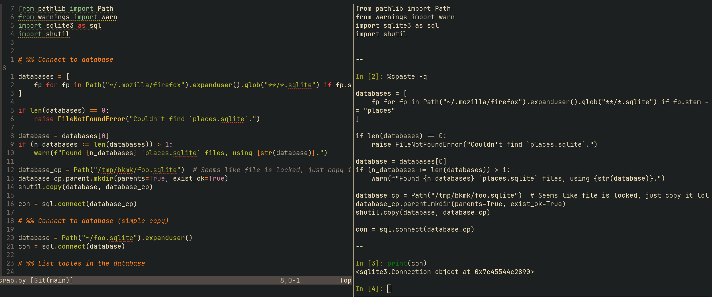

+++
title = 'Small project workflow'
date = 2024-02-28T20:24:23+10:00
draft = false
+++

# Small project workflow: The making of `foxtail`

Something I've wanted to do for a while is to make a tool to make it easier to write content for
this blog. Often I save bookmarks when I browse the internet, and when I save bookmarks I make a
mental note to come back to that link to revisit and review it and perhaps even write about it (a
mental note that is doomed to be forgotten in the business of the day).

So I thought about how could I build a tool to make that process easier. I've got much more
experience than before, and challenged myself to cobble together a tool for this in a matter of
hours (and also post about it, because perhaps there's something to learnd from writing/reading
this).


## The problem statement

A tool like this would make it easier to write "newsletter" type posts. Often when I feel like
writing -- especially about topics I've read about online -- I get discouraged because I feel like I
wont be able to avoid repeating points that were much more eloquently stated in the source material.

On the other hand, I think there's a bit of value in taking the time to write summaries or lists of
"stuff I found interesting this week". It may not be read by anyone, but it would be a more detailed
way to keep track of good content over time.

I use Firefox on all my devices, the syncing of bookmarks is great. However I'm not a huge fan of
the GUI for manually managing the bookmarks and reviewing them. Being a command line junkie, it
would be ideal to be able to execute a single command to dump a list of recently added bookmarks to
a file (formatted in Markdown) so I can quickly remove junk bookmarks from the post and add a bit of
commentary on why each link was noteworthy to me.


## Quick googling

I know the path I want to take, this sort of deadline demands a language that's fast to work in. I'm
not designing for other users -- really at this point it's just a proof of concept I wanted to prove
to myself.

So I searched for how to approach this. Looks like Firefox uses a `places.sqlite` file to track user
data like this. I recall `sqlite` is part of the baselib of python (from a compile error I
experienced a while ago), which made me wonder if it'd be possible to query it.

I had no idea where to find this file though. Running some `fd` commands in `~` reveals some
results after a bit of trial and error. After a few attempts, I printed the directories of where
`*.sqlite` were stored in `~`:

```bash
$ fd -HI --extension 'sqlite' | cut -d '/' -f 1-3 | uniq
# .dots/ipython/.ipython
# .mozilla/firefox/ikgk9jo5.default-release
```

Only 2 directories to look though! Using a more direct query:
```bash
$ fd -HI 'places.sqlite'
# .mozilla/firefox/ikgk9jo5.default-release/places.sqlite
# .mozilla/firefox/ikgk9jo5.default-release/places.sqlite-wal
```

Alrighty, we've got a target to experiment with!


## Experimental setup and equipment

I have a central repo for experiments and one-off sort of exercises that don't really fit into their
own repo called [scratchpad](https://github.com/BlakeJC94/scratchpad). I don't fret best practices
here, this is just for experiments.

To make sure dependencies don't get in the way, I'll create a new project with `poetry new` called
"bookmarks" and `cd bookmarks; vim scrap.py`, which is where I'll try to open and query
`places.sqlite`. I'll launch `poetry shell` to launch my virtual environment.

In a future post I'll probably write more extensively about my `vim`/`tmux`/`python` setup, but the
vim plugins I rely on for this are:
* [jpalardy/vim-slime](https://github.com/jpalardy/vim-slime)
* [hanschen/vim-ipython-cell](https://github.com/hanschen/vim-ipython-cell)

Main reasons I use this: I'm a command line junkie and I like my vim keybindings. While I liked the
idea of `jupyter`, I'm less enthused by leaving my terminal and keybindings away. (Plus I prefer to
keep my work out of the browser so I can alt-tab instead of ctrl-tab and getting lost in the 30+
tabs I have open).

With this setup, I can write code between `# %%` blocks and execute these blocks with `<C-c><C-c>`
to pipe this text into a neighboring `tmux` split with an running `ipython` session.



So let's get writing!


## From exploration to prototype

Import some stuff and try open it (googling along the way when I get something I don't understand)

```python
from pathlib import Path
from warnings import warn
import sqlite3 as sql
import shutil


# %% Connect to database

databases = [
    fp for fp in Path("~/.mozilla/firefox").expanduser().glob("**/*.sqlite") if fp.stem == "places"
]

if len(databases) == 0:
    raise FileNotFoundError("Couldn't find `places.sqlite`.")

database = databases[0]
if (n_databases := len(databases)) > 1:
    warn(f"Found {n_databases} `places.sqlite` files, using {str(database)}.")

con = sql.connect(database_cp)
```

This works! But I encountered a file lock error when trying to `.execute` a basic query -- probably
locked by Firefox while it's open. I'll quickly just copy it and see if that works

```python
# %% Connect to database (simple copy)

database_cp = Path("/tmp/bkmk/foo.sqlite")  # Seems like file is locked, just copy it lol
database_cp.parent.mkdir(parents=True, exist_ok=True)
shutil.copy(database, database_cp)

database = Path("~/foo.sqlite").expanduser()
con = sql.connect(database)
```

Now we're in business! How can I list the avliable tables? Some quick googling suggests this method:

```python
# %% List tables in the database

query = "SELECT name FROM sqlite_master WHERE type='table';"
cursor = con.cursor()

res = cursor.execute(query).fetchall()

print(res)
# [('moz_origins',),
#  ('moz_places',),
#  ('moz_places_extra',),
#  ('moz_historyvisits',),
#  ('moz_historyvisits_extra',),
#  ('moz_inputhistory',),
#  ('moz_bookmarks',),
#  ('moz_bookmarks_deleted',),
#  ('moz_keywords',),
#  ('sqlite_sequence',),
#  ('moz_anno_attributes',),
#  ('moz_annos',),
#  ('moz_items_annos',),
#  ('moz_meta',),
#  ('moz_places_metadata',),
#  ('moz_places_metadata_search_queries',),
#  ('moz_previews_tombstones',),
#  ('sqlite_stat1',)]
```

Looks like `moz_bookmarks` would be worth querying:

```python
# %% List columns in `moz_bookmarks`

query = "SELECT * FROM moz_bookmarks"
res = cursor.execute(query).description
print([r[0] for r in res])
# ['id',
#  'type',
#  'fk',
#  'parent',
#  'position',
#  'title',
#  'keyword_id',
#  'folder_type',
#  'dateAdded',
#  'lastModified',
#  'guid',
#  'syncStatus',
#  'syncChangeCounter']

# %% What's in here??
query = "SELECT * FROM moz_bookmarks"
res = cursor.execute(query).fetchall()
print(res)
# Seems like `dateAdded` is in epoch seconds?
```

Ah, but this table doesn't have URLs? The table `moz_places` seems like it might be a pretty central
table, what's in there?

```python
# %% List columns in `moz_places`, Maybe there's a key to join on? probs `guid`?

query = "SELECT * FROM moz_places"

res = cursor.execute(query)
print("---")
print(res.fetchall())
print("---")
print([r[0] for r in res.description])
# ['id',
#  'url',
#  'title',
#  'rev_host',
#  'visit_count',
#  'hidden',
#  'typed',
#  'frecency',
#  'last_visit_date',
#  'guid',
#  'foreign_count',
#  'url_hash',
#  'description',
#  'preview_image_url',
#  'site_name',
#  'origin_id',
#  'recalc_frecency',
#  'alt_frecency',
#  'recalc_alt_frecency']
```

The answer didn't jump out immediately, but I managed to get it after a bit of trial and error. This
`vim-slime` setup allows me to tighten that REPL loop, so I can get the solution faster (even if
many trials and errors are needed).


```python
# %% How about id? Pretty sure this is a local table id key though

q1 = "SELECT fk FROM moz_bookmarks"
res1 = cursor.execute(q1).fetchall()
res1 = {r[0] for r in res1}

q2 = "SELECT id FROM moz_places"
res2 = cursor.execute(q2).fetchall()
res2 = {r[0] for r in res2}

print("---")
print(f"{len(res1)=}")
print(f"{len(res2)=}")
print(f"{len(res2 & res1)=}")
print("---")
# ---
# len(res1)=359
# len(res2)=8699
# len(res2 & res1)=346
# ---

# %% Bingo! Try join and query

query = """
SELECT p.url, b.title, b.dateAdded
FROM moz_places p INNER JOIN moz_bookmarks b
ON p.id = b.fk;
"""

res = cursor.execute(query)
print("---")
print(res.fetchmany(5))
# [('https://www.mozilla.org/privacy/firefox/', 'mobile', 1708123255251000),
# ('https://blog.inkdrop.app/how-to-set-up-neovim-0-5-modern-plugins-lsp-treesitter-etc-542c3d9c9887',
# 'How To Manage Python with Pyenv and Direnv | DigitalOcean', 1678053275812000),
# ('https://discuss.pytorch.org/t/how-to-implement-keras-layers-core-lambda-in-pytorch/5903',
# 'Programmer Interrupted: The Real Cost of Interruption and Context Switching', 1680757287482000),
# ('https://github.com/shMorganson/dot-files/blob/a858e28d1adbc0a5a7b13d8a2600c2014ec8b376/nvim/.config/nvim/lua/plugins/highlights/custom_highlights.vim',
# 'Gentle Dive into Math Behind Convolutional Neural Networks | by Piotr Skalski | Towards Data
# Science', 1634531361569000), ('https://muhammadraza.me/2022/data-oneliners/', 'CNN Explainer',
# 1634539466342000)]
```


Amazing! I'd like to see If I can work in base python, but for exploration I'll `!pip install pandas` in my `ipython` REPL for a bit of quick and dirty exploration

```python
# %% Nice! Now use `WHERE` and chuck it all into a DataFrame

import time
from datetime import timedelta
import pandas as pd

cur_time = int(time.time())
delta = timedelta(hours=7).total_seconds()

query = f"""
SELECT p.url, b.title, b.dateAdded
FROM moz_places p INNER JOIN moz_bookmarks b
ON p.id = b.fk
WHERE b.dateAdded > {(cur_time - delta) * 1e6};
"""

res = cursor.execute(query)
res = pd.DataFrame(res.fetchall(), columns=[r[0] for r in res.description])
print("---")
print(res)
# ---
#                                                  url                                              title         dateAdded
# 0  https://www.youtube.com/watch?v=MCs5OvhV9S4&li...  David Beazley - Python Concurrency From the Gr...  1709086750127000
# 1        https://www.youtube.com/watch?v=zduSFxRajkE            Let's build the GPT Tokenizer - YouTube  1709091384964000


# %% Alrighty take these results and sort and groupby day (just a bit of pandas munging)
#
from datetime import datetime
import pytz

res["dtAdded"] = res["dateAdded"].apply(
    lambda x: datetime.fromtimestamp(x / 1e6, tz=pytz.timezone("Australia/Melbourne"))
)
res = res.sort_values("dateAdded")

lines = []
lines.append("# Bookmarks from the last week")
lines.append("")

for k, v in res.groupby(res["dtAdded"].dt.date):
    lines.append(f"## {k}")
    lines.append("")
    for _, row in v.sort_values("dateAdded").iterrows():
        lines.append(f"[{row['title']}]({row['url']})")
        lines.append("")

print("---")
print("\n".join(lines))
print("---")
# ---
# # Bookmarks from the last week
#
# ## 2024-02-28
#
# [David Beazley - Python Concurrency From the Ground Up: LIVE! - PyCon 2015 - YouTube](https://www.youtube.com/watch?v=MCs5OvhV9S4&list=WL&index=2)
#
# [Let's build the GPT Tokenizer - YouTube](https://www.youtube.com/watch?v=zduSFxRajkE)
#
# ---
```

Now looks like all the pieces are there. Let's bring it all together in a single block, remove the
`pandas` dependency, and make it executable with a single function `main()`:
```python
# %% Sick! That prototype works. Now let's get it working in an E2E block without requiring pandas

import argparse
import shutil
import sqlite3
import tempfile
from datetime import timedelta
from itertools import groupby
from pathlib import Path
from time import time
from typing import Dict, List, Tuple


def parse() -> argparse.Namespace:
    parser = argparse.ArgumentParser()
    parser.add_argument("firefox_dir", default="~/.mozilla/firefox")
    return parser.parse_args()


def get_database(firefox_dir: Path | str) -> Path:
    firefox_dir = Path(firefox_dir).expanduser()
    databases = [
        fp
        for fp in firefox_dir.glob("**/*.sqlite")
        if fp.stem == "places"
    ]

    if len(databases) == 0:
        raise FileNotFoundError("Couldn't find `places.sqlite`.")

    database = databases[0]
    if (n_databases := len(databases)) > 1:
        warn(f"Found {n_databases} `places.sqlite` files, using {str(database)}.")

    return database


def query_database(database: Path, delta: float | int) -> List[Tuple[str, str, int]]:
    cur_time = time()
    with sqlite3.connect(database) as con:
        cursor = con.cursor()

        query = f"""
        SELECT p.url, b.title, b.dateAdded
        FROM moz_places p INNER JOIN moz_bookmarks b
        ON p.id = b.fk
        WHERE b.dateAdded > {(cur_time - delta) * 1e6};
        """

        return cursor.execute(query).fetchall()


def format_results(results: List[Tuple[str, str, int]]) -> List[str]:
    grouped_results: Dict[str, List[Tuple[str, str, int]]] = {
        k: list(v)
        for k, v in groupby(results, key=lambda x: datetime.fromtimestamp(int(x[2] / 1e6)).date())
    }

    lines = []
    lines.append("# Bookmarks from the last week")
    lines.append("")

    for date in sorted(grouped_results.keys()):
        lines.append(f"## {date}")
        lines.append("")

        date_results = sorted(grouped_results[date], key=lambda x: x[2])
        for url, title, _ in date_results:
            lines.append(f"[{title}]({url})")
            lines.append("")

    return lines


def main():
    args = parse()
    database = get_database(args.firefox_dir)
    with tempfile.TemporaryDirectory() as tmpdirname:
        database_cp = Path(tmpdirname) / "places.sqlite"
        shutil.copy(database, database_cp)
        results = query_database(database_cp, delta=timedelta(days=7).total_seconds())

    lines = format_results(results)
    print("---")
    print("\n".join(lines))
    print("---")


main()
```

And there we have it! There were a few bugs I had to weed out in the 20-ish minutes of writing and
debugging that, but starting with `def main():` and adding comments, and turning each comment into
its own function, helped to add the basic structure needed to make this comprehensible.

And so, this final block (with some minor edits) was good enough to lump into `bookmarks/__main__.py`. I added a basic `argparse` to allow specifying a different firefox directory (in case it's not on `~/.mozilla/firefox`) and adjusting `delta` to a custom number of hours and days.

And finally to spice up the name, I consulted ChatGPT for a few suggestions, and `foxtail` was a
pretty nice one! So I changed the name, copied this `__main__.py` script to a new repo and added a
`README` and uploaded it to [BlakeJC94/foxtail](https://github.com/BlakeJC94/foxtail)


## Conclusion

This was a pretty nice exercise, and thought it would be nice to document how I approached a small
scope project for my own review. Hopefully there will be some new content here soon, some of these
bookmarks I summarise may even branch out into their own posts!
